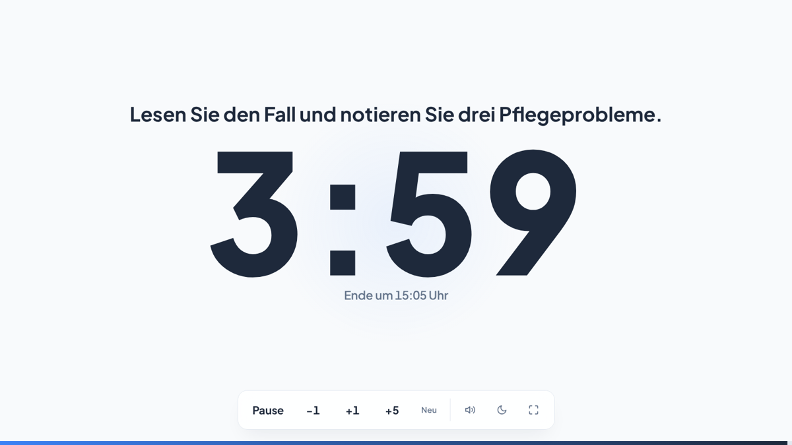

# Unterrichtstimer

Ein schlanker Countdown-Timer für den Unterricht – gemacht für Beamer, Smartboard und Tablet.

**▶ Timer öffnen: https://florianloyns.github.io/unterrichtstimer/**

Datenschutzfreundlich by design: eine einzige, in sich geschlossene HTML-Datei. Keine Cookies, keine Speicherung auf dem Gerät, keine externen Quellen, kein Tracking.



## Funktionen

- Große, aus der letzten Reihe lesbare Ziffern mit Fortschrittsbalken
- Arbeitsauftrag über dem Timer, der während der Arbeitsphase sichtbar bleibt
- Schnellwahl (3, 5, 10, 15, 20, 45 Minuten) und eigene Zeiten wie `7`, `2,5` oder `1:30`
- Endzeit („Ende um 10:45 Uhr“), damit die Lerngruppe sich selbst orientieren kann
- Letzte Minute in Orange mit leisem Hinweiston, Ablauf in Rot mit Gong
- Zeit während der Laufzeit verlängern oder verkürzen (`+1`, `+5`, `−1`)
- Bedienleiste und Mauszeiger verschwinden während der Arbeitsphase
- Dunkelmodus, Vollbild, Ton aus – per Knopf oder Tastenkürzel
- Bildschirm bleibt während der Laufzeit an (sofern der Browser es unterstützt)
- Läuft auch ohne Internet: `index.html` herunterladen und per Doppelklick öffnen

## Bedienung

| Taste | Wirkung |
|---|---|
| `1` – `6` | Schnellwahl starten (3, 5, 10, 15, 20, 45 Min.) |
| `E` | Eigene Zeit eingeben |
| `Leertaste` | Start / Pause / Weiter |
| `+` / `-` | Eine Minute mehr / weniger |
| `A` | Arbeitsauftrag bearbeiten (`Enter` zum Übernehmen) |
| `F` | Vollbild |
| `D` | Dunkelmodus |
| `M` | Ton an / aus |
| `Esc` | Zurücksetzen (nur wenn der Timer pausiert oder abgelaufen ist) |

Ein Klick auf die Ziffern pausiert bzw. setzt fort; nach Ablauf setzt er den Timer zurück.

## Timer als Link – z. B. aus Folien

Über URL-Parameter lässt sich ein Timer vorbereiten. Die Links funktionieren direkt aus PowerPoint, reveal.js, Moodle oder einem Tafelbild heraus.

| Parameter | Beispiel | Wirkung |
|---|---|---|
| `min` | `min=12` oder `min=1:30` | Zeit voreinstellen |
| `start` | `start=1` | sofort starten (sonst wartet der Timer auf „Start“) |
| `auftrag` | `auftrag=Partnerarbeit%20Fall%202` | Arbeitsauftrag anzeigen |
| `presets` | `presets=2,5,8,12` | eigene Schnellwahl (bis zu 9 Werte) |
| `dunkel` | `dunkel=1` / `dunkel=0` | dunkel oder hell öffnen (ohne Angabe: Systemeinstellung) |
| `ton` | `ton=0` | stumm starten |

Fertige Beispiele zum Kopieren:

| Situation | Link |
|---|---|
| 15 Min. Einzelarbeit mit Auftrag | https://DEIN-GITHUB-NAME.github.io/unterrichtstimer/?min=15&auftrag=Pflegeprobleme%20formulieren |
| 5 Min. Pause, startet sofort | https://DEIN-GITHUB-NAME.github.io/unterrichtstimer/?min=5&start=1&auftrag=Pause |
| Gruppenarbeit, dunkel, eigene Schnellwahl | https://DEIN-GITHUB-NAME.github.io/unterrichtstimer/?dunkel=1&presets=10,20,30,40 |
| Prüfungssituation ohne Ton | https://DEIN-GITHUB-NAME.github.io/unterrichtstimer/?min=45&ton=0&auftrag=Klausur |

Leerzeichen im Auftrag als `%20` schreiben. Umlaute funktionieren in den meisten Programmen direkt, sicherer ist die kodierte Form (`ä` = `%C3%A4`, `ö` = `%C3%B6`, `ü` = `%C3%BC`, `ß` = `%C3%9F`).

Tipp: Wer immer dieselben Einstellungen nutzt, legt sich den passenden Link als Lesezeichen an.

Hinweis: Browser spielen Töne erst nach einer ersten Berührung oder einem Klick auf der Seite ab. Bei `start=1` daher einmal kurz auf den Bildschirm tippen.

## Offline nutzen

1. `index.html` aus diesem Repository herunterladen (Datei öffnen → „Download raw file“).
2. Auf Schulrechner, USB-Stick oder Smartboard-PC ablegen.
3. Per Doppelklick öffnen – Schrift und Icon sind eingebettet, es wird nichts nachgeladen.

Die URL-Parameter funktionieren auch lokal, z. B. `file:///C:/Timer/index.html?min=10`.

## Datenschutz

Der Timer selbst verarbeitet keine personenbezogenen Daten:

- keine Cookies
- keine Speicherung auf dem Gerät (kein `localStorage`, kein `sessionStorage`, keine IndexedDB, kein Service Worker, kein Cache)
- keine externen Quellen (keine Google Fonts, kein CDN, keine Analyse- oder Tracking-Dienste)
- der Arbeitsauftrag existiert nur im Browserfenster und ist nach dem Schließen weg

Das wurde automatisiert im Browser geprüft: Beim Aufruf und bei der Bedienung wird ausschließlich `index.html` selbst angefragt, Cookies und Browserspeicher bleiben leer.

**Hosting über GitHub Pages:** Die Online-Version liegt auf GitHub Pages. GitHub verarbeitet als Hoster technisch bedingt die IP-Adresse beim Abruf der Seite (Server-Logs). Das betrifft das Hosting, nicht den Timer. Details stehen in der [GitHub-Datenschutzerklärung](https://docs.github.com/de/site-policy/privacy-policies/github-general-privacy-statement). Wer das vermeiden möchte, nutzt die [Offline-Variante](#offline-nutzen) oder legt `index.html` auf den Server bzw. ins LMS der eigenen Schule.

## Eigene Version erstellen

1. Oben rechts auf **Fork** klicken – das Repository wird in den eigenen Account kopiert.
2. Im Fork unter **Settings → Pages** bei „Source“ *Deploy from a branch*, Branch `main`, Ordner `/ (root)` wählen.
3. Nach ein bis zwei Minuten läuft die eigene Version unter `https://<eigener-name>.github.io/unterrichtstimer/`.

Anpassungen (z. B. Farben oder Standard-Schnellwahl) erfolgen direkt in `index.html`. Die Farben stehen gesammelt am Anfang des `<style>`-Bereichs, die Schnellwahl in der Zeile `presets = [3, 5, 10, 15, 20, 45]`.

## Projektstruktur

```
├── index.html             Timer – vollständig eigenständig (HTML, CSS, JS, Schrift, Icon)
├── manifest.webmanifest   Name und Icon beim Anheften auf dem Startbildschirm
├── icons/                 App-Icons für das Manifest
├── fonts/OFL.txt          Lizenz der eingebetteten Schrift Plus Jakarta Sans
└── docs/screenshot.png
```

## Ideen für spätere Versionen

- Nachlaufzeit nach Ablauf anzeigen (`+0:42`)
- Mehrere Phasen hintereinander (z. B. 10 Min. Einzelarbeit → 15 Min. Gruppenarbeit → 5 Min. Plenum)
- Lautstärkeregler und Auswahl verschiedener Signaltöne

## English summary

A privacy-friendly countdown timer for the classroom: one self-contained HTML file with no cookies, no local storage and no external requests. Open it at **https://DEIN-GITHUB-NAME.github.io/unterrichtstimer/** or download `index.html` and use it offline. The interface is in German; keyboard shortcuts and URL parameters are listed above.

## Lizenz

Code: [MIT](LICENSE) · Schrift: SIL Open Font License 1.1 ([fonts/OFL.txt](fonts/OFL.txt))
